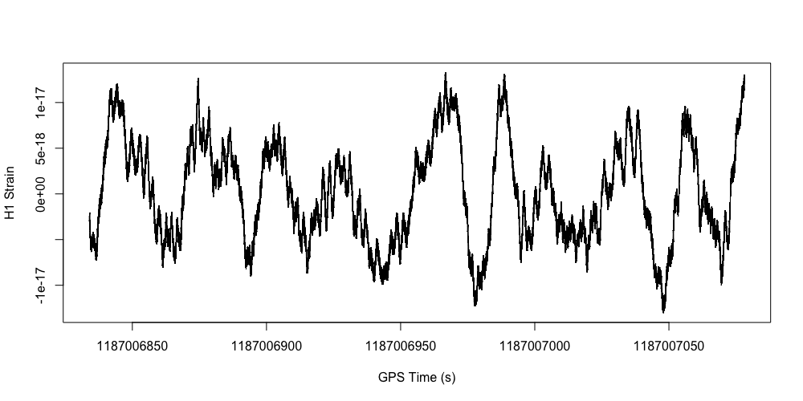

1. Завантажте файл з даними за посиланням https://dcc.ligo.org/public/0146/P1700337/001/H-H1_LOSC_C00_4_V1-1187006834-4096.hdf5
```r
dataUrl <- "https://dcc.ligo.org/public/0146/P1700337/001/H-H1_LOSC_C00_4_V1-1187006834-4096.hdf5"
dataFileName = "lab2Data.hdf5"
download.file(dataUrl, dataFileName, 'auto', TRUE)
```
2. Встановіть в R пакет для роботи з HDF5 файлами.
```r
install.packages("BiocManager")
BiocManager::install("rhdf5")
library(rhdf5)
```
3. Виведіть зміст файлу командою h5ls().
```r
h5ls(dataFileName)
```
```
                 group            name       otype  dclass      dim
0                    /            meta   H5I_GROUP                 
1                /meta     Description H5I_DATASET  STRING    ( 0 )
2                /meta  DescriptionURL H5I_DATASET  STRING    ( 0 )
3                /meta        Detector H5I_DATASET  STRING    ( 0 )
4                /meta        Duration H5I_DATASET INTEGER    ( 0 )
5                /meta        GPSstart H5I_DATASET INTEGER    ( 0 )
6                /meta     Observatory H5I_DATASET  STRING    ( 0 )
7                /meta            Type H5I_DATASET  STRING    ( 0 )
8                /meta        UTCstart H5I_DATASET  STRING    ( 0 )
9                    /         quality   H5I_GROUP                 
10            /quality          detail   H5I_GROUP                 
11            /quality      injections   H5I_GROUP                 
12 /quality/injections InjDescriptions H5I_DATASET  STRING        5
13 /quality/injections   InjShortnames H5I_DATASET  STRING        5
14 /quality/injections         Injmask H5I_DATASET INTEGER     4096
15            /quality          simple   H5I_GROUP                 
16     /quality/simple  DQDescriptions H5I_DATASET  STRING        7
17     /quality/simple    DQShortnames H5I_DATASET  STRING        7
18     /quality/simple          DQmask H5I_DATASET INTEGER     4096
19                   /          strain   H5I_GROUP                 
20             /strain          Strain H5I_DATASET   FLOAT 16777216
```
4. Зчитайте результати вимірів. Для цього зчитайте name Strain з групи strain
в змінну strain. Після зчитування не забувайте закривати файл командою
H5Close().
```r
strain <- h5read(dataFileName, "strain/Strain")
H5close()
strain
```
```
   [1] -2.391646e-18 -2.411660e-18 -2.427382e-18 -2.426351e-18 -2.427996e-18 -2.446291e-18 -2.462962e-18 -2.463456e-18 -2.464039e-18
  [10] -2.481933e-18 -2.499762e-18 -2.499653e-18 -2.499740e-18 -2.514827e-18 -2.534504e-18 -2.539017e-18 -2.534552e-18 -2.547276e-18
  [19] -2.567941e-18 -2.573345e-18 -2.569082e-18 -2.580038e-18 -2.601175e-18 -2.606781e-18 -2.602693e-18 -2.610871e-18 -2.633490e-18
  [28] -2.643470e-18 ...
```
5. Також з «strain/Strain» зчитайте атрибут (функція h5readAttributes)
Xspacing в змінну st та виведіть її. Це інтервал часу між вимірами.
```r
st <- h5readAttributes(dataFileName, "strain/Strain")$Xspacing
H5close()
st
```
```
[1] 0.0002441406
```
6. Знайдіть час початку події та її тривалість. Для цього з групи meta зчитайте
в змінну gpsStart name GPSstart та в змінну duration name Duration.
```r
gpsStart <- h5read(dataFileName, "meta/GPSstart")
H5close()

duration <- h5read(dataFileName, "meta/Duration")
H5close()

gpsStart
duration
```
```
[1] 1187006834
[1] 4096
```
7. Знайдіть час закінчення події та збережіть його в змінну gpsEnd.
```r
gpsEnd <- gpsStart + duration
gpsEnd
```
```
[1] 1187010930
```
8. Створіть вектор з часу вимірів і збережіть у змінну myTime. Початок
послідовності – gpsStart, кінець – gpsEnd, крок – st.
```r
myTime <- seq(gpsStart, gpsEnd, st)
myTime
```
```
   [1] 1187006834 1187006834 1187006834 1187006834 1187006834 1187006834 1187006834 1187006834 1187006834 1187006834 1187006834 1187006834
  [13] 1187006834 1187006834 1187006834 1187006834 1187006834 1187006834 1187006834 1187006834 1187006834 1187006834 1187006834 1187006834
  [25] 1187006834 ...
```
9. Побудуємо графік тільки для першого мільйону вимірів. Для цього створіть
змінну numSamples, яка дорівнює 1000000.
```r
numSamples <- 1000000
```
10. Побудуйте графік за допомогою функції plot(myTime[0:numSamples],
strain[0:numSamples], type = "l", xlab = "GPS Time (s)", ylab = "H1 Strain")
```r
plot(myTime[0:numSamples], strain[0:numSamples], type = "l", xlab = "GPS Time (s)", ylab = "H1 Strain")
```

